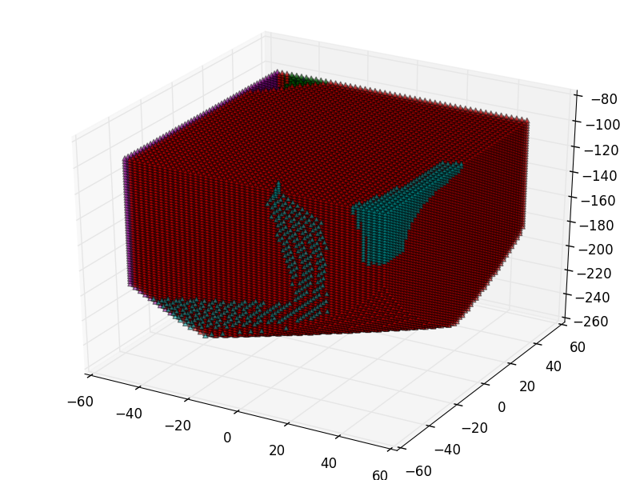

実行方法
---
```sh
$ ./analyze.py 100 200 80 10 -s 2
```

ヘルプ
--
```sh
$ ./analyze.py -h
usage: analyze.py [-h] [--sparseness SPARSENESS] l1 l2 r1 r2

Analyze about motion of parallel link

positional arguments:
  l1                    l1
  l2                    l2
  r1                    r1
  r2                    r2

optional arguments:
  -h, --help            show this help message and exit
  --sparseness SPARSENESS, -s SPARSENESS
                        The sparseness when analyzing points and theta.
                        Default is 1 and this means x moving is per 1mm.
```

実行結果(例)
--
```
$ ./analyze.py 100 200 80 10 -s 1
Limits: X(-50:50), Y(-50:50) Z:(-287:-100)
Min Self theta change: 0.00394473724183
Min MinOf3 theta change: 4.13106988617e-08
Min MaxOf3 theta change: 0.299459039743
Order [-3.0, -2.0, -1.0, 0.0, 1.0]
Color ['b', 'g', 'r', 'c', 'm']
```


