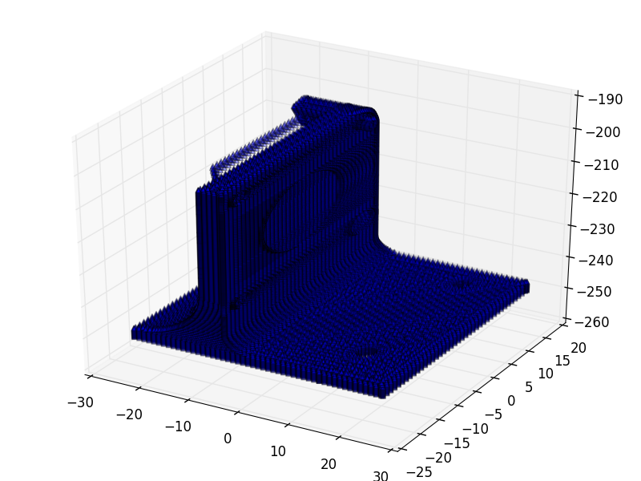

# Gcodeをパラレルリンクの腕の角度へ変換


## Gcodeから線形補間した移動経路

```bash
$ python gcode2points.py
```

### 3D Printed 画像




### 3D Printing 動画

[](http://youtu.be/3DQpn81zP6k)


## Gcode → 線形補間した経路 → パラレルリンクの腕の角度

```bash
$ python gcode2thetas.py ./sample_stldata/DD_carriage_for_atom.gcode 100 200 80 10
```
